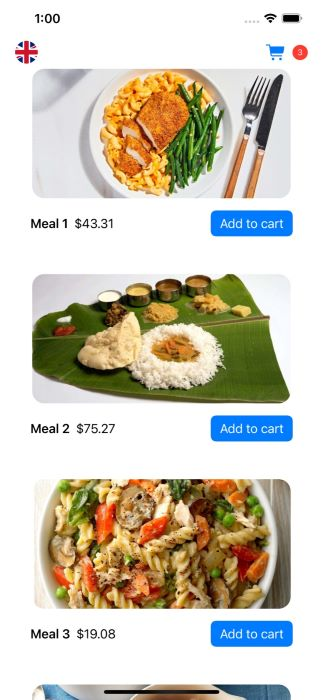
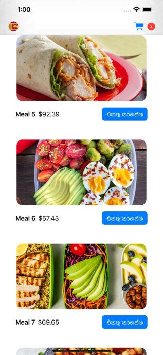
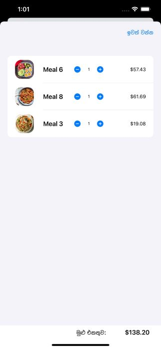
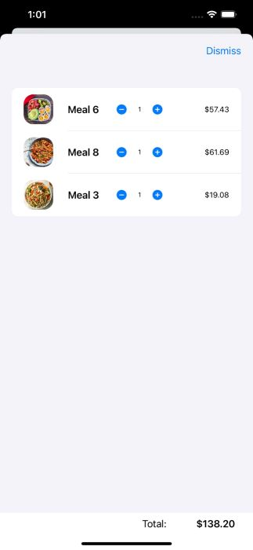
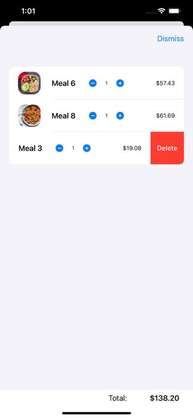
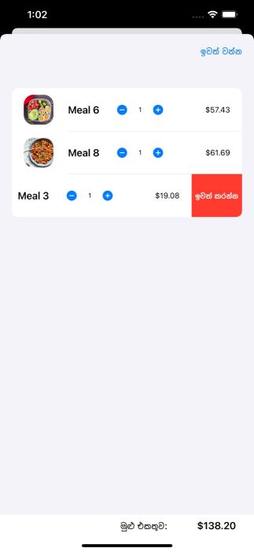
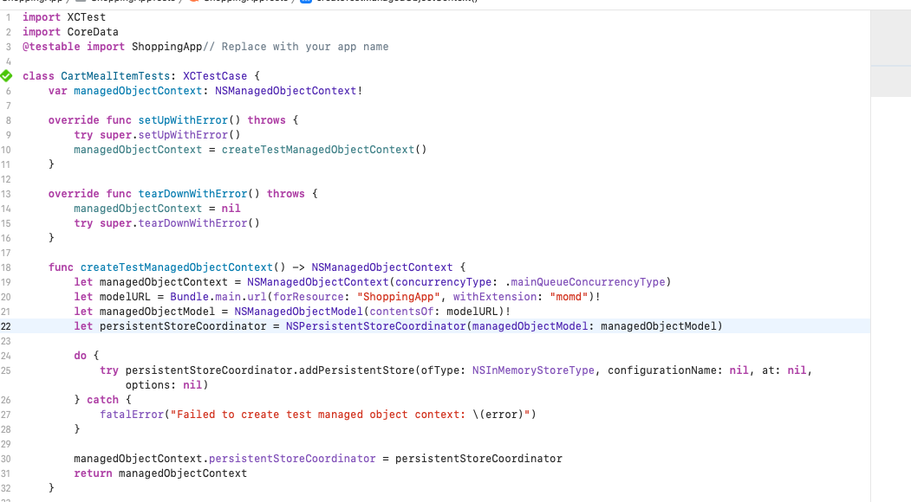
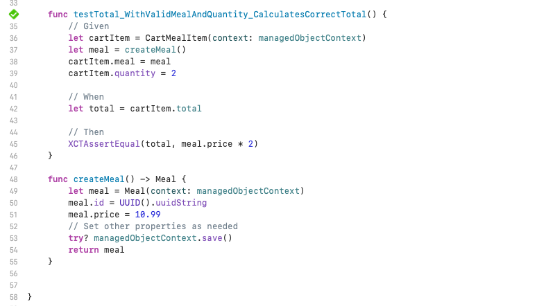

[](https://classroom.github.com/a/sHz1bMKn)
Please go under edit and edit this file as needed for your project.  There is no seperate documentation needed.

# Project Name - Shopping App
# Student Id - IT20274320  
# Student Name - K.M.M.Y.S.RANATHUNGA  

#### 01. Brief Description of Project - 

Nowadays, with everyone leading busy lives, I have decided to create an online mobile application for shopping. This application will provide users with a convenient way to browse through products and add them to their shopping carts effortlessly. Users will be able to navigate through the app seamlessly and make changes to their shopping cart as needed.The shopping cart functionality will allow users to edit the quantity of items they have added, making it easy for them to adjust their order according to their preferences. Additionally, users will have the option to remove items from their shopping cart with just a few taps.One special feature of this application is its localization capability. Users will be able to change the application language effortlessly. This will ensure that the app caters to users from different regions and provides them with a personalized shopping experience.Furthermore, as part of the development process, attention will be given to correcting any grammatical errors and ensuring a smooth user interface. This will enhance the overall user experience and make the application user-friendly and enjoyable to navigate.By creating this online mobile shopping application, I aim to provide users with a convenient, efficient, and customizable shopping experience that fits seamlessly into their busy lifestyles.


#### 02. Users of the System - 

The users of this app could include anyone who wants to conveniently purchase items online. This app caters to buyers of various backgrounds, such as busy professionals, students, parents, and individuals with specific shopping needs. It is particularly beneficial for those who are looking to save time and effort by shopping from the comfort of their own homes or while on the go.

#### 03. What is unique about your solution - 

Our solution stands out from others in the market due to its unique features and user-friendly design. Here are the key aspects that make our application special:

Localization: Our app incorporates a localization feature that allows users to effortlessly change the language of the application. This ensures that users from 
              different regions can enjoy a seamless shopping experience in their preferred language.

Easy Cart Management: We have implemented a simple and intuitive interface for adding items to the shopping cart. Users can effortlessly browse through products and add 
                      them to their cart with just a few taps. Additionally, our app allows users to update the quantity of items in the cart or remove them entirely, 
                      making it easy to customize their purchase. And also application genarate total price. its very usefull for users 

Smooth Navigation:   Our application prioritizes a smooth and user-friendly navigation experience. Users can effortlessly move between different pages within the app, 
                     making it simple to explore various categories, search for specific items, and access their shopping cart.

These unique features set our application apart by providing users with a convenient and personalized shopping experience. The localization feature ensures inclusivity, easy cart management streamlines the purchasing process, and smooth navigation enhances overall usability. With these key elements, our app offers a standout solution for online shopping on mobile devices.

#### 04. Differences of Assignment 02 compared to Assignment 01

In Assignment 1, I developed a diet planning application where users can create personalized diet plans by specifying food names and setting dates for each meal. They can easily view their created diet plans within the app. However, this application did not include the functionality to update or delete items from the diet plans, and it also lacked a localization feature to change the application language.

In Assignment 2, I created a shopping application that allows users to add items from a product list to their shopping cart. They can conveniently update the quantity of items in the cart and delete unwanted items. Additionally, this shopping app incorporates a localization feature, enabling users to change the application language according to their preferences.

In Assignment 2, in addition to the features mentioned earlier, the shopping application also includes the ability to calculate the total price of the items in the user's shopping cart.As users add items to their cart, the application keeps track of the prices associated with each item. When the user is ready to review their cart or proceed to checkout, the app automatically calculates the total price by summing up the prices of all the items in the cart.This feature provides users with a clear understanding of the overall cost of their selected items, enabling them to make informed purchasing decisions and stay within their budget.By incorporating the cart items' total price calculation, the shopping application aims to enhance the shopping experience by providing transparency and convenience to the users.
Please let me know if there's anything else you would like to know or any further improvements you would like to make.

#### 05. Briefly document the functionality of the screens you have (Include screen shots of images)


     

Scrolling: Users can effortlessly scroll up or down to browse through the available content, such as products, services, or information.

Adding Items to Cart: Users can conveniently add items to their cart. This functionality allows them to select desired products or services and save them for checkout at a later time.

Language Selection: By clicking on the flag icon located at the top left corner, users can easily change the application's language. This feature enhances accessibility for users who prefer different languages.

Cart Navigation: By clicking on the cart icon positioned at the top right corner, users can effortlessly navigate to their cart. This feature enables a quick and convenient way to access the items they have selected for purchase

     

Using this interface, users can view the items they have added to their cart along with their respective prices. Additionally, the interface provides the total price for all items in the cart.
Users can edit the count of each item in the cart using the "-" and "+" buttons. These buttons allow users to decrease or increase the quantity of a particular item

      

Users can easily delete cart items, as shown in the screenshot. This functionality allows users to remove specific items from their cart with ease


#### 06. Give examples of best practices used when writing code

```
import SwiftUI
import CoreData

struct HomeView: View {
    @Environment(\.managedObjectContext) private var viewContext
    @Binding var lang: String

    @FetchRequest(
        sortDescriptors: [NSSortDescriptor(keyPath: \Meal.mealName, ascending: true)],
        animation: .default) var meals: FetchedResults<Meal>

    @FetchRequest(
        sortDescriptors: [NSSortDescriptor(keyPath: \CartMealItem.id, ascending: true)],
        animation: .default) var cartItems: FetchedResults<CartMealItem>
    
    @State private var showCart = false

    var body: some View {
        GeometryReader { geometry in
            NavigationView {
                ScrollViewReader(content: { proxy in
                    ScrollView(.vertical, showsIndicators: false) {
                        LazyVStack {
                            ForEach(meals) { meal in
                                ZStack {
                                    VStack {
                                        Image(meal.image!)
                                            .resizable()
                                            .scaledToFill()
                                            .frame(width: geometry.size.width * 0.8, height: geometry.size.width * 0.4)
                                            .clipped()
                                            .cornerRadius(16)
                                        Spacer().frame(height: 16)
                                        HStack {
                                            Text(meal.mealName!).font(.headline)
                                            Text(meal.priceString).font(.body)
                                            Spacer()
                                            Button {
                                                if let index = cartItems.firstIndex(where: {$0.meal!.id == meal.id}) {
                                                    cartItems[index].quantity += 1
                                                } else {
                                                    let item = CartMealItem(context: viewContext)
                                                    item.id = UUID().uuidString
                                                    item.meal = meal
                                                    item.quantity = 1
                                                    try? viewContext.save()
                                                }
                                            } label: {
                                                Text("Add to cart")
                                            }
                                            .buttonStyle(.borderedProminent)
                                        }
                                        .padding([.leading, .trailing], 40)
                                        Spacer().frame(height: 50)
                                    }
                                }
                            }
                        }

                        .toolbar {
                            ToolbarItem(placement: .navigationBarTrailing) {
                                ZStack {
                                    HStack {
                                        Image(systemName: "cart.fill")
                                            .foregroundColor(.blue)
                                        if (cartItems.map({$0.quantity}).reduce(0, +) != 0) {
                                            Text("\(cartItems.map({$0.quantity}).reduce(0, +))")
                                                .font(.system(size: 11))
                                                .foregroundColor(.white)
                                                .frame(width: 20, height: 20, alignment: .center)
                                                .background(Color.red)
                                                .clipShape(Capsule())
                                                .minimumScaleFactor(0.3)
                                        }
                                    }
                                    Button("") {
                                        showCart.toggle()
                                    }
                                }
                            }
                            ToolbarItem(placement: .navigationBarLeading) {
                                ZStack {
                                    Button {
                                        LocalizationService.shared.toggleLanguage()
                                        lang = LocalizationService.shared.language.rawValue
                                    } label: {
                                        Image(LocalizationService.shared.language.icon)
                                            .resizable()
                                            .aspectRatio(contentMode: .fit)
                                            .frame(width: 30, height: 30)
                                            .clipShape(Circle())
                                    }

                                }
                            }
                    }
                        .sheet(isPresented: $showCart) {
                            CartView()
                                .environment(\.locale, .init(identifier: lang))
                        }
                    }
                })
            }
        }
    }
}

struct ContentView_Previews: PreviewProvider {

    static var previews: some View {
        PreviewWrapper(lang: .init(initialValue: "en"))
    }

    struct PreviewWrapper:View {
        @State(initialValue: "en") var lang: String

        var body: some View{
            HomeView(lang: $lang)
                .environment(\.locale, .init(identifier: lang))
                .environment(\.managedObjectContext, PersistenceController.preview.container.viewContext)
        }
    }
}
............................................................................................................................................................................
import SwiftUI

struct CartView: View {
    @Environment(\.dismiss) var dismiss
    @Environment(\.managedObjectContext) private var viewContext

    @FetchRequest(
        sortDescriptors: [NSSortDescriptor(keyPath: \CartMealItem.id, ascending: true)],
        animation: .default) var cartItems: FetchedResults<CartMealItem>

    var body: some View {
        GeometryReader { geometry in
            NavigationView {
                VStack {
                    List {
                        ForEach(cartItems, id: \.self) { item in
                            HStack {
                                Image(item.meal!.image!)
                                    .resizable()
                                    .scaledToFill()
                                    .frame(width: 50, height: 50)
                                    .clipped()
                                    .cornerRadius(16)
                                Spacer().frame(width: 16)
                                Text(item.meal!.mealName!)
                                    .font(.headline)
                                    .frame(width: 70)
                                    .font(.system(size: 12))
                                    .multilineTextAlignment(.center)
                                Spacer().frame(width: 20)
                                HStack {
                                    Button {
                                        if item.quantity != 0 {
                                            item.quantity -= 1
                                            try? viewContext.save()
                                        }
                                    } label: {
                                        Image(systemName: "minus.circle.fill")
                                    }.buttonStyle(BorderlessButtonStyle())
                                    Text("\(item.quantity)")
                                        .frame(width: 25)
                                        .font(.system(size: 11))
                                    Button {
                                        item.quantity += 1
                                        try? viewContext.save()
                                    } label: {
                                        Image(systemName: "plus.circle.fill")
                                    }.buttonStyle(BorderlessButtonStyle())
                                }
                                Spacer()
                                Text(item.total.currency)
                                    .font(.system(size: 13))
                                    .minimumScaleFactor(0.3)
                            }
                            .swipeActions(allowsFullSwipe: false) {
                                Button(role: .destructive) {
                                    delete(cartItem: item)
                                } label: {
                                    Text("Delete")
                                }
                            }
                        }
                    }

                    .toolbar {
                        ToolbarItem(placement: .navigationBarTrailing) {
                            Button("Dismiss") {
                                dismiss()
                            }
                        }
                    }
                    HStack {
                        Spacer()
                        Text("Total:")
                        Spacer().frame(width: 50)
                        Text(cartItems.map({$0.total}).reduce(0, +).currency)
                            .font(.headline)
                    }
                    .padding(.trailing, 30)
                }
            }
        }
    }

    private func delete(cartItem: CartMealItem) {
        withAnimation {
            viewContext.delete(cartItem)
            do {
                try viewContext.save()
            } catch {
                let nsError = error as NSError
                fatalError("Unresolved error \(nsError), \(nsError.userInfo)")
            }
        }
    }

}

struct CartView_Previews: PreviewProvider {
    static var previews: some View {
        CartView().environment(\.managedObjectContext, PersistenceController.preview.container.viewContext)
    }
}

```

#### 07. UI Components used

NavigationView,GeometryReader,ScrollViewReader,ScrollView,LazyVStack,ForEach,ZStack,VStack,Image,Spacer,HStack,Text,Button,.buttonStyle(),.sheet(),List,swipeActions
,.toolbar(),ToolbarItem

#### 08. Testing carried out
          
```
    import XCTest
import CoreData
@testable import ShoppingApp

class CartMealItemTests: XCTestCase {
    var managedObjectContext: NSManagedObjectContext!

    override func setUpWithError() throws {
        try super.setUpWithError()
        managedObjectContext = createTestManagedObjectContext()
    }

    override func tearDownWithError() throws {
        managedObjectContext = nil
        try super.tearDownWithError()
    }

    func createTestManagedObjectContext() -> NSManagedObjectContext {
        let managedObjectContext = NSManagedObjectContext(concurrencyType: .mainQueueConcurrencyType)
        let modelURL = Bundle.main.url(forResource: "ShoppingApp", withExtension: "momd")!
        let managedObjectModel = NSManagedObjectModel(contentsOf: modelURL)!
        let persistentStoreCoordinator = NSPersistentStoreCoordinator(managedObjectModel: managedObjectModel)
        
        do {
            try persistentStoreCoordinator.addPersistentStore(ofType: NSInMemoryStoreType, configurationName: nil, at: nil, options: nil)
        } catch {
            fatalError("Failed to create test managed object context: \(error)")
        }
        
        managedObjectContext.persistentStoreCoordinator = persistentStoreCoordinator
        return managedObjectContext
    }

    func testTotal_WithValidMealAndQuantity_CalculatesCorrectTotal() {
        // Given
        let cartItem = CartMealItem(context: managedObjectContext)
        let meal = createMeal()
        cartItem.meal = meal
        cartItem.quantity = 2

        // When
        let total = cartItem.total

        // Then
        XCTAssertEqual(total, meal.price * 2)
    }

    func createMeal() -> Meal {
        let meal = Meal(context: managedObjectContext)
        meal.id = UUID().uuidString
        meal.price = 10.99
        // Set other properties as needed
        try? managedObjectContext.save()
        return meal
    }

  
}

```

#### 09. Documentation 

a) Design Choices:

The design follows a simple and clean layout with a vertical scrolling interface for the home screen (HomeView).
Each meal item is displayed with an image, meal name, price, and an "Add to cart" button.
The cart icon is positioned in the top right corner, providing quick access to the cart.
The flag icon is positioned in the top left corner, allowing users to change the application language.

(b) Implementation Decisions:

The code utilizes SwiftUI, which is a declarative framework for building user interfaces.
The NavigationView is used to provide navigation functionality and create a navigation bar.
ScrollView and LazyVStack are used to create a scrollable list of meal items.
Core Data is used to fetch and manage data for meals and cart items.
@FetchRequest is used to fetch data from Core Data and display it in the views.
The sheet modifier is used to present the CartView as a modal sheet when the cart icon is tapped.
Various SwiftUI components such as Image, Text, Button, and ToolbarItem are used to build the user interface.

(c) Challenges:

One potential challenge could be implementing the functionality to add, edit, and delete items in the cart. This may involve managing the state of cart items, updating Core Data entities, and synchronizing the changes with the user interface.
Another challenge could be handling localization and language switching. Ensuring that the language change updates the user interface elements appropriately and reflects the selected language consistently throughout the app.
Designing the layout and positioning of UI elements to create an intuitive and user-friendly interface can also present challenges, especially when dealing with various screen sizes and orientations.

Overall, the implementation relies on SwiftUI's powerful features and concepts to create a smooth user experience, manage data with Core Data, and handle various design and localization considerations.

#### 10. Additional iOS Library used
(1)Prepare localized strings: 
      In your project, create localized strings files for each supported language. These files typically have a .strings extension and contain key-value pairs, where the 
      keys represent the string identifiers and the values represent the localized strings.

(2)Localize text in SwiftUI views:
      Wrap your static text strings in the Text view and use the Localizable.strings key as the argument for the Text view's initializer. 
      For example:Text("hello_key")
      
(3)Localize dynamic content: 
      For dynamically changing content, such as data fetched from Core Data, you can leverage the LocalizedStringKey type to provide localized values. You can use the 
      LocalizedStringKey as an argument to Text or other SwiftUI views to display the localized content.

(4)Set the application's locale:
     You can set the application's locale programmatically to update the language at runtime. This can be achieved by setting the Locale using Environment or by modifying 
     the app's Bundle localization settings.


#### 11. Reflection of using SwiftUI compared to UIKit

SwiftUI is a modern declarative framework for building user interfaces introduced by Apple in iOS 13. It offers a fundamentally different approach compared to UIKit, the traditional imperative framework that has been used for iOS development for many years. Here are some reflections on using SwiftUI compared to UIKit:

Declarative Syntax: SwiftUI follows a declarative syntax, where you describe the desired state and appearance of your user interface. This approach allows for more concise and readable code, as you define what the UI should look like based on the current state, rather than manually manipulating the UI elements.

Less Boilerplate Code: SwiftUI significantly reduces the amount of boilerplate code required compared to UIKit. SwiftUI automatically manages view updates and state changes, eliminating the need for manual handling of view lifecycles and event-driven code.

SwiftUI Views: SwiftUI introduces a new set of views that are lightweight and composable. Views are built using a hierarchy of modifiers that can be chained together, enabling easy customization and reusability. This approach simplifies the process of creating complex UI layouts.

Live Preview: SwiftUI provides a live preview feature, allowing developers to see the changes made in code instantly in the Xcode preview canvas. This accelerates the development process by providing immediate feedback without needing to run the app on a simulator or device.

Cross-Platform Support: SwiftUI is designed to be cross-platform, enabling developers to build applications for iOS, macOS, watchOS, and tvOS using a shared codebase. This promotes code reuse and reduces the effort required to target multiple platforms.

Integration with Combine: SwiftUI seamlessly integrates with Combine, Apple's framework for reactive programming. This combination allows for elegant and efficient handling of asynchronous operations, data flow, and event-driven programming.

Learning Curve: While SwiftUI offers numerous benefits, it also introduces a learning curve, especially for developers who are already familiar with UIKit. SwiftUI introduces new concepts and ways of thinking about UI development, which may require some time to grasp and adapt to.

Compatibility: SwiftUI is available starting from iOS 13 and macOS 10.15 Catalina. As a result, projects that require support for earlier versions of iOS or macOS may still need to rely on UIKit or a hybrid approach.

In summary, SwiftUI brings a more modern, declarative, and streamlined approach to iOS and macOS development. While it offers numerous advantages in terms of code simplicity, reusability, and live previews, it also requires developers to familiarize themselves with new concepts and adjust their thinking from the traditional UIKit approach

#### 12. Reflection General

Data Management: Implementing a data management system, such as Core Data, can present challenges in terms of setting up the data model, handling data fetching and saving, and ensuring data consistency.

UI Design: Designing a user-friendly and visually appealing interface requires careful consideration of layout, color schemes, typography, and responsiveness across different screen sizes and orientations.

Localization: Integrating localization can be challenging, particularly when dealing with multiple languages and managing localized strings. Ensuring proper string translations and handling dynamic content localization can add complexity to the project.

State Management: Managing the state of the application, including tracking cart items, updating quantities, and handling UI updates, requires careful consideration to ensure consistent and synchronized behavior.

Testing and Debugging: Verifying the functionality of the application and identifying and fixing any potential bugs or issues can be time-consuming. Thorough testi
  

